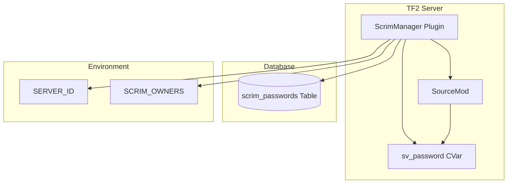
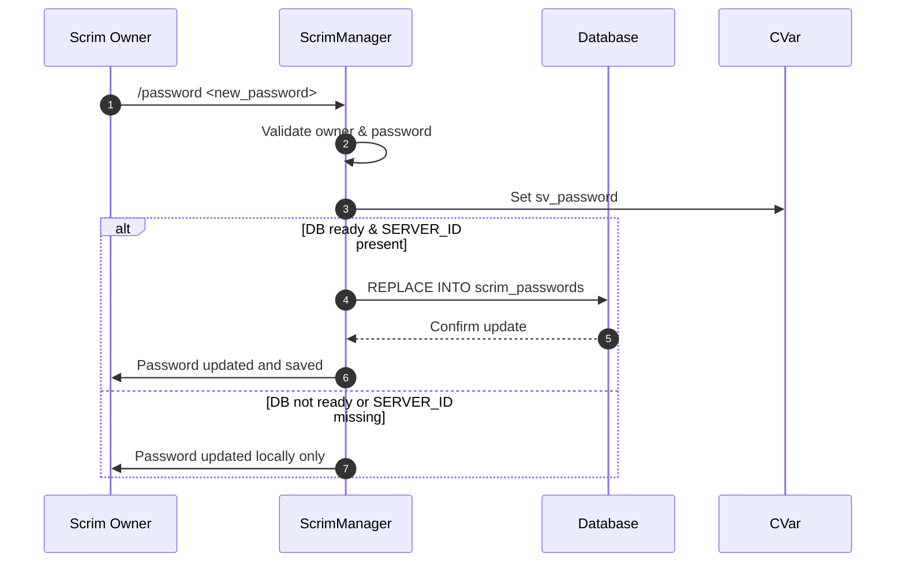
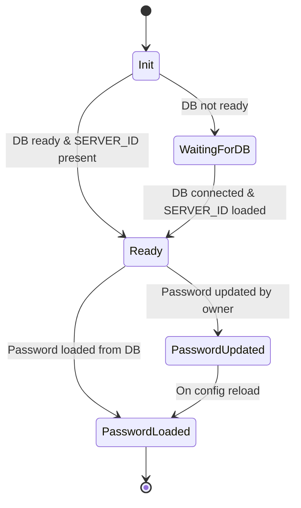

# ScrimManager

ScrimManager is a SourceMod plugin for Team Fortress 2 servers that manages scrim owners and coordinates password persistence, enabling secure and automated control of server access for competitive matches.

[](LICENSE)

## Overview

ScrimManager solves the problem of securely managing server passwords and owner access for scrim (competitive) matches in TF2. It automates password persistence using a database, ensures only designated owners have root access, and provides a simple command interface for password updates. The plugin leverages SourceMod's scripting capabilities and integrates with server environment variables for flexible configuration.

Key technologies used include SourceMod, SourcePawn, and SQL database integration for password storage.

### Key Responsibilities

- **Coordinate**: Manages scrim password persistence and updates via database.
- **Authorize**: Grants root access to designated scrim owners based on environment configuration.
- **Automate**: Loads and applies stored passwords automatically on server start/config reload.
- **Secure**: Ensures only authorized users can set or retrieve passwords.

## Architecture



## How It Works

### Password Update Flow



### Password Persistence State Machine



## Features

- **Automatic password persistence**: Stores and retrieves scrim passwords from a database for each server instance.
- **Owner access control**: Grants root access to SteamIDs listed in the SCRIM_OWNERS environment variable.
- **Command-based password update**: Allows owners to update the server password via /password command.
- **Environment-driven configuration**: Uses SERVER_ID and SCRIM_OWNERS for flexible deployment.
- **Database integration**: Supports SQL-based storage for password persistence.
- **Safe password handling**: Escapes and validates password inputs to prevent injection.
- **Config reload support**: Automatically reapplies stored password on config execution.
- **Logging and error reporting**: Logs actions and errors for audit and troubleshooting.
- **Graceful shutdown**: Cleans up database and owner list resources on plugin end.
- **Extensible design**: Easily adaptable for additional scrim management features.

## Prerequisites

- Team Fortress 2 server with SourceMod installed
- SourceMod 1.10+ (recommended)
- SQL database configured (see DATABASE_CONFIG)
- Access to set environment variables (SERVER_ID, SCRIM_OWNERS)
- SteamIDs for scrim owners

## Installation

1. Place `ScrimManager.sp` in your SourceMod scripting directory.
2. Compile to generate `ScrimManager.smx`.
3. Place `ScrimManager.smx` in your SourceMod plugins directory.
4. Configure your SQL database in SourceMod's `databases.cfg` with the name `scrimmanager`.
5. Set environment variables `SERVER_ID` and `SCRIM_OWNERS` as needed.
6. Restart your TF2 server.

## Configuration

### Environment Variables

| Variable         | Description                                 | Default | Required |
|------------------|---------------------------------------------|---------|----------|
| `SERVER_ID`      | Unique identifier for the server instance   | None    | Yes      |
| `SCRIM_OWNERS`   | Comma-separated SteamID64s for root access  | None    | No       |

## Development

### Project Structure

```
ScrimManager/
├── LICENSE
├── README.md
├── plugins/
│   └── ScrimManager.smx         # Compiled plugin
├── scripting/
│   ├── ScrimManager.sp          # SourcePawn plugin source
│   └── include/
│       └── env_variables.inc    # Environment variable helpers
```

## License

See [LICENSE](LICENSE) file for details.

## Dependencies

- [SourceMod](https://www.sourcemod.net/) - Scripting and plugin framework for Source engine games
- [SourcePawn](https://wiki.alliedmods.net/SourcePawn) - Scripting language for SourceMod
- [SQL Database](https://wiki.alliedmods.net/SQL_(SourceMod)) - Used for password persistence

